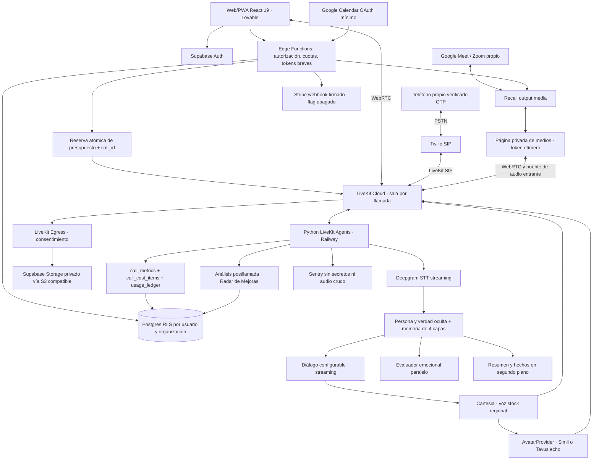

# Arquitectura de Réplica — Fase 1

Estado: propuesta implementable; benchmark de proveedores pendiente de cuentas y presupuesto. React 19 aprobado por el owner (ADR-0002). No hay despliegue ni llamadas de producción.

## Fronteras y contratos

- El frontend original vive en `src/`; `apps/web` documenta esa ubicación. El worker persistente no se ejecuta en Edge Functions. `packages/shared` contendrá esquemas Zod versionados y contratos JSON para Python; las migraciones y RLS llegan en Fase 3.
- Una llamada tiene `call_id`, `org_id`, propietario, canal, proveedores/versiones de tarifa, consentimiento y estado. El servidor deriva organización/roles desde Auth; nunca confía en un `org_id` enviado por el cliente.
- `AvatarProvider`: `start(session, room, stock_face, emotion)`, `wait_ready`, `close`, estado, capacidades, identificador de sesión y métricas. Expresiones disponibles se declaran por proveedor; no se simula soporte de gestos ausentes.
- Tavus usa PAL `echo` con transporte LiveKit. Mantiene el cerebro y TTS propios: su precio integral NO permite asumir que esos consumos son gratuitos en esta integración.
- El bot recibe el audio de participantes desde la API de medios en tiempo real de Recall y lo publica en LiveKit; la pista de salida se reproduce en su página. Evitar el retorno de su propia voz. Renderizar video sin ese puente de entrada no alcanza para conversar.
- Egress usa credenciales S3 de servidor, bucket privado y acceso posterior por URL firmada. Validar endpoint/región/path-style y subida multipart contra staging antes de afirmar compatibilidad end-to-end. Recall no incluye el video del propio bot en su grabación; conservar Egress para ese compuesto.

## Ciclo de vida y costo

`requested → authorized → budget_reserved → waiting_for_user → connecting → active → closing → closed/failed`.

Solo después de confirmar presencia del usuario se crean avatar, bot y grabación. En Meet/Zoom, obtener presencia de webhooks de participantes; si el proveedor obliga a conectar antes, pedir al usuario presencia en lobby y mantener un timeout breve. Reserva transaccional e idempotente antes de cualquier recurso; límite de una sesión activa por usuario al comenzar.

Cierre en `finally` más supervisor independiente: desconexión del usuario, colgar, 90 minutos o silencio de ambos durante 180 segundos con aviso y 60 segundos de gracia. Aviso a los 80 minutos. Configurar proveedores a ≥5700 segundos cuando lo permitan; los planes más cortos no pasan el requisito. Reconexión de STT/TTS entre turnos con contexto preservado no equivale a probar continuidad perceptual.

Al fallar el avatar, conservar la sesión de voz y avisar; no iniciar otra cara en paralelo sin presupuesto reservado. Al 100% del presupuesto mensual se bloquean nuevas Llamadas Completas, sin cortar las ya reservadas. Reconciliar facturas/webhooks con estimaciones mediante ajustes auditables y clave única de proveedor/sesión/componente/intervalo.

## Memoria, latencia y región

Mantener últimos N turnos + resumen cada cinco minutos + hechos duros + persona/estado. Tamaño de contexto acotado; evaluador emocional no bloquea el audio. Modelos por tarea configurables y congelados por llamada. No mezclar datos de organizaciones en cachés.

Objetivos de producto: voz p50≤800/p95≤1300 ms, video p50≤1100/p95≤1600 ms, interrupción≤200 ms. Presupuesto orientativo p50: detección de fin 250 ms, primer token 250, primera voz 150, red/reproducción150; avatar añade hasta300. Son objetivos de ingeniería, no mediciones ni garantías de proveedores.

Comparar worker en regiones disponibles cercanas a usuarios AR/MX y a STT/TTS. No asumir que una región sudamericana gana frente a US con proveedores ubicados allí. Medir RTT, jitter, pérdida y tiempo hasta audio reproducido, por acento y región. Continuidad de 90 minutos requiere el ensayo de resistencia de Fase 12.

## Seguridad y recuperación

Tokens LiveKit breves, permisos de sala mínimos, sin service_role en navegador. Rostros/voces de catálogo; sin carga de identidades reales. Teléfono propio verificado y reuniones propias consentidas. Flags billing/phone/meetings/premium inicialmente apagados. Webhooks firmados, deduplicación, RLS entre organizaciones, retención/borrado real y redacción de logs se verificarán en sus fases.

Si el worker cae, un reconciliador consulta llamadas activas y cierra recursos huérfanos; presupuesto reservado no se libera hasta reconciliar cobros. Un registro de cierre fallido es incidente, nunca éxito silencioso.

Fuentes: [LiveKit Simli](https://docs.livekit.io/agents/models/avatar/plugins/simli/), [Tavus echo](https://docs.livekit.io/agents/models/avatar/plugins/tavus/), [Recall output media](https://docs.recall.ai/docs/stream-media). Ver matriz y ADRs para decisiones y límites.
